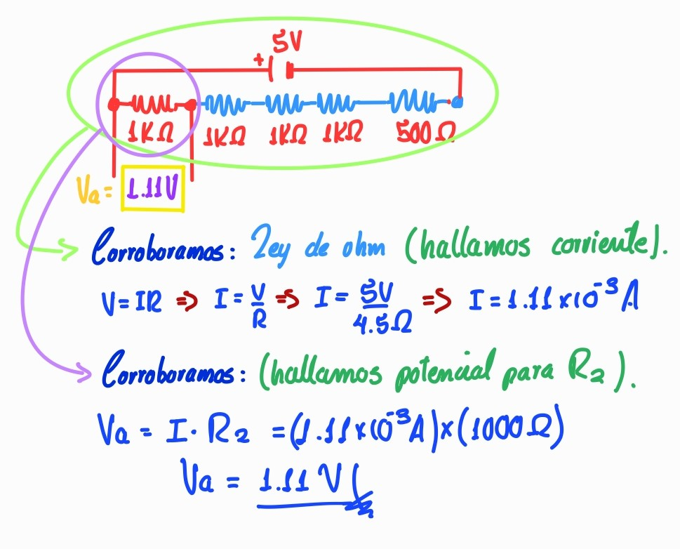

 “Año del Bicentenario, de la consolidación de nuestra Independencia, y de la conmemoración de las heroicas batallas de Junín y Ayacucho” 

# 
 UNIVERSIDAD PERUANA CAYETANO HEREDIA 

### 
 Facultad de Ciencias y Filosofía “Alberto Cazorla Talleri” 

  

### 
 FUNDAMENTOS DE DISEÑO 

### Docentes:👨‍🏫

  - Mg Umbert Lewis De La Cruz  
  - Mg. Paulo Camilo Vela Antón 
  - Mg. Moises Stevend Meza Rodriguez 
  - Dr. Harry Anderson Rivera Tito 
  - Ing. Juan Manuel Zuñiga Mamani  
  - Ing. Renzo José Chan Ríos

### Integrantes:   👩‍🎓🧑‍🎓                                                                           

  - Bernal Belisario, Brigitte
  - Llanos Angeles Leily Marlith
  - Luque Mamani, Magno Ricardo
  - Quispe Baldeon, Melissa
  - Turpo Huaman, Nilda Maribel (Coordinadora general)

  Lima-2024

-------------------------------------------------------------------------------------------------------------------------------------------------------------

# Práctica 1: Manejo de protoboard

## *Ejercicio 1:*

### Explicación: 
  - En el presente circuito, trabajamos con resistencias de 220 ohm de las cuales se encontraban en serie y paralelo, respectivamente:

  **Calculando en serie:**
  
  Rs: Suma de resistencia en serie

   Rs= 220 ohm + 220 ohm = 440 ohm
    
   Considerando dicho resultado (Rs), procedemos a calcular en paralelo.
    
   **Calculando en paralelo:**

   Rt: Suma de resistencia total
    
   1/Rt = 1/Rs + 1/220 ohm
    
   1/Rt = 1/440 ohm + 1/220 ohm
    
   Rt = (440 ohm)(220 ohm)/440 ohm+220 ohm
    
   Rt = 146.6 ohm

  - Por lo cual de este caso concluimos que la resistencia total nos dió 146.6 ohm y comparando con el resultado del multimetro, dicho cálculo estaría correcto.

<table style="width: 100%;">
    <tr>
        <td style="border: 0px solid #ddd; padding: 4px; text-align: center;">
            
        </td>
        <td style="border: 0px solid #ddd; padding: 4px; text-align: center;">
            
        </td>
        <td style="border: 0px solid #ddd; padding: 4px; text-align: center;">
            
        </td>
    </tr>
</table>

  

## *Ejercicio 2:*

En el experimento aplicativo, se elaboró un esquema en hexagonal, situando en paralelo las resistencias de 220 ohm a los extremos cada uno, y al centro en forma de serie, dos resistencias de 220 ohm y por el lado derecho, lleva una resistencia de 220 ohm, adicional.

Dado que  se conectaba  a un mismo nodo que las resistencias en paralelo de los extremos de 220 ohm , se verificó que producía un cortocircuito, este hecho fue corraborado al medir su voltaje y resultaba 0 ohm,  con ayuda del multímetro.

Por lo que testeamos la manera de evitar dicho corto circuito,y es así que concideramos trabajar solamente con la parte hexagonal que esta conformado por serie y paralelo.

Calculando la serie:

 Rs= 220ohm + 220ohm = 440ohm 

De lo cual, nos quedaría lo siguiente:

De este modo, procedemos a calcular la resistencia equivalente de la distribución en paralelo.

Y tal como planteamos, el circuito cumple con eficacia el objetivo en medición del multímetro, sin presencia de cortocircuito y con normalidad. ¡Verificado!

## Ejercicio 3:

Para el desarrollo de este ejercicio identificamos las ubicaciones de las resistencias(serie o paralelo).

Resistencias: 

*R1(220 ohm)

*R2(220 ohm)

*R3(220 ohm)

*R4(1000 ohm)

*R5(220 ohm)

*R6(220 ohm).

Rs: Resistencia en serie

RT: Resistencia total

**Serie_1:** **R1,** **R3**

 Rs1 = 220ohm + 220ohm = 440 ohm

**Serie_2:** **R5,** **R6**

 Rs2 = 220ohm + 220ohm = 440 ohm

**Serie_3:** **R2,** **R4**

 Rs3 = 220ohm + 1000ohm = 1220ohm

**Paralelo:** **serie_1,** **Serie_2,** **Serie_3**

 1/RT = 1/ 440ohm + 1/440ohm + 1/1220ohm

 RT = 186.0ohm

Calculando y remplazando con los valores de las resistencias respectivamente y aplicando la fórmula de la resistencia como también del paralelo, el resultado final fue 186.39 ohm, en la imagen podemos ver la respuesta comparada con el resultado del multímetro que fue 186.0 ohm.

<table style="width: 100%;">
    <tr>
        <td style="border: 0px solid #ddd; padding: 4px; text-align: center;">
            
        </td>
        <td style="border: 0px solid #ddd; padding: 4px; text-align: center;">
            
        </td>
        <td style="border: 0px solid #ddd; padding: 4px; text-align: center;">
            
        </td>
    </tr>
</table>

## Tema 1.1: Circuitos útiles

## *Ejercicio 4:*

En este ejercicio se presenta la implementación de resistencias para lograr una salida de 1.1V (OUTPUT) partiendo de una entrada de 5V (INPUT). A continuación, se dará a conocer el procedimiento teórico para encontrar dicho diferencial de potencial de 1.1 V:
 
Antes de comenzar, cabe resaltar que, para encontrar una relación entre las resistencias, se utilizó el "Circuito Divisor de Tensión", el cual es una aplicación de la Ley de ohm que nos permite encontrar el voltaje de salida reducido de una resistencia y se basa en la siguiente fórmula:

Vout: Voltaje de salida

Vin: Voltaje de entrada

  

El desarrollo se basa en lo siguiente: 

- Despejando la relación entre las resistencias para el correspondiente estimado. 

  

- Asignando el valor de 1k ohm a la resistencia 2 (R2) para encontrar la resistencia 1 (R1). 

  

- Verificamos con el modelo del circuito.

  

- De este modo, obtenemos:

  

Este último resultado corrobora la parte teórica del ejercicio, pero también se comprobó en la parte experimental, como se muestra a continuación:

  

