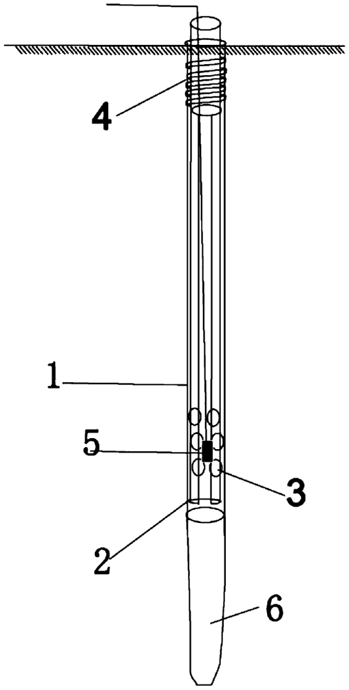

Realizar una investigación sobre la situación actual en los ámbitos comercial y científico, con el fin de identificar una serie de requisitos. Posteriormente, plantear una solución para abordar una problemática específica.

## ARTÍCULOS

### 🚜ARTÍCULO 1:

### 
  BFSF: A secure IoT based framework for smart farming using blockchain 

### 
  (BFSF: un marco seguro basado en IoT para la agricultura inteligente utilizando blockchain) 

#### 🚜Descripción:

En esta investigación se investigan los modelos de machine learning y block-chain para partir por el registro de las condiciones donde se están gestando los cultivos, luego, detecta los problemas que acarrean dichas condiciones mediante sus algoritmos, y después predice los medios óptimos para que se desarrolle un mejor ambiente para preservarlos.
La arquitectura consta de tres capas: la capa de cultivo (CPS), la capa de borde y la capa de red blockchain. La capa de cultivo se encarga de recopilar y transmitir datos de los sensores desplegados en el campo agrícola. La capa de borde utiliza un modelo basado en inteligencia artificial para analizar los datos y generar información útil para la toma de decisiones. La capa de red blockchain proporciona una plataforma segura y descentralizada para registrar y verificar los datos agrícolas y facilitar las transacciones entre los participantes de la cadena de suministro.

#### Medición de confianza de los distintos modelos de aprendizaje automático a prueba

En el estudio muestra la evolución de los modelos de machine learning que determinan la condición actual del cultivo , y muestra la forma predictiva mediante su base de datos la forma de mejorar la condición ambiental del cultivo.
El informe indica que el rendimiento del modelo de Random Forest es superior, alcanzando una precisión del 97%, en contraste con el Support Vector Classifier (SVC) que registra un 93%, el K-Nearest Neighbors (KNN) con un 90%, y la Regresión Logística con un 84%. Esta tecnología ayuda a reducir costos y mejorar la calidad general del proceso agrícola y la gestión de productos con una gestión de cadena de suministro basada en blockchain para mejorar el contexto económico de los agricultores.(Shreya, S.,2023).

**Fuente** Shreya, S., Chatterjee, K., & Singh, A. (2023). BFSF: A secure IoT based framework for smart farming using blockchain. Sustainable Computing: Informatics and Systems, 40, 100917. Recuperado de [URL](https://doi.org/10.1016/j.suscom.2023.100917) o [Documento.](../../Documentación/art_1.pdf)

### 🚜ARTÍCULO 2: 
### 
 Engineering Pseudomonas putida KT2440 for simultaneous degradation of carbofuran and chlorpyrifos
 
### 
 (Ingeniería Pseudomonas putida KT2440 para la degradación simultánea de carbofurano y clorpirifos) 

#### 🚜Descripción: 

El estudio de este artículo se centra en la contaminación combinada, causada por los pesticidas clorpirifos (CP) y carbofurano en suelos agrícolas. Su objetivo fue desarrollar un microorganismo recombinante capaz de degradar simultáneamente el CP y el carbofurano. Para lograr esto, se integraron los genes para la degradación de estos pesticidas en una cepa de Pseudomonas putidaKT2440. La cepa recombinante resultante mostró una menor toxicidad de los productos de hidrólisis en comparación con los compuestos originales y pudo utilizar CP o carbofurano como única fuente de carbono para el crecimiento. La inoculación de la cepa recombinante en suelos tratados con carbofurano y CP resultó en una tasa de degradación más alta que en suelos no inoculados. Además, la proteína fluorescente verde introducida se puede utilizar como biomarcador para rastrear la cepa recombinante durante la biorremediación. Esto sugiere que la cepa recombinante tiene potencial para ser aplicada en la biorremediación de suelos contaminados con carbofurano y CP.

Los resultados de los experimentos de degradación con P. putida KTU-PGC mostraron una eficiente capacidad de degradación de carbofurano y CP, con una tasa de degradación más alta en comparación con P. putida KTU en las mismas condiciones. Además, los experimentos de remediación de suelos con muestras no expuestas previamente a pesticidas demostraron que la inoculación con P. putida KTU-PGC resultó en una reducción significativa de la concentración de carbofurano y CP en el suelo. Estos hallazgos sugieren que la cepa recombinante tiene un gran potencial para la biorremediación de suelos co-contaminados con carbofurano y CP (T. Gong et al., 2016).

**Fuente:** Gong, T., Liu, R., Che, Y., Xu, X., Zhao, F., Yu, H., Song, C., Liu, Y., & Yang, C. (2016). Engineering Pseudomonas putida KT2440 for simultaneous degradation of carbofuran and chlorpyrifos. Microbial Biotechnology, 9(6), 792-800. Recuperado de [URL](https://ami-journals.onlinelibrary.wiley.com/doi/full/10.1111/1751-7915.12381) o [Documento.](../../Documentación/art_2.pdf)

### 🚜ARTÍCULO 3:  
### 
 Soil pH Mapping with an On-The-Go Sensor  
   
###  
 (Mapeo de pH del suelo con un sensor On-The-Go) 
   

 En el presente artículo, se emplea el sensor Veris pH Manager con el objetivo de determinar el pH del suelo en las tierras de cultivo en Alemania. Es así que, se enfoca en tres escenarios: (a) la realización de pruebas en un entorno de laboratorio bajo condiciones controladas, (b) la ejecución de pruebas en transectos con interrupciones y marchas, y (c) la realización de pruebas en condiciones prácticas en el campo. Los datos recopilados revelan una relación consistente y estrecha entre los valores convencionales del laboratorio y las mediciones registradas por los sensores. Estos estudios ofrecen una evaluación exhaustiva del rendimiento del sensor de pH del suelo en diversas circunstancias. El análisis de estos enfoques contribuye a comprender la versatilidad y aplicabilidad del sistema en diferentes entornos. La exitosa implementación del sensor en condiciones prácticas se refleja en la automatización de mediciones en movimiento y la comparación con valores de laboratorio para validar los resultados.

En condiciones prácticas de campo, la correlación entre los valores de pH obtenidos mediante el sensor y los del laboratorio experimentó una mejora significativa con la calibración, especialmente al incorporar datos de conductividad eléctrica del suelo en un entorno con variaciones de textura. Aunque este sensor muestra cierta precisión, es importante destacar que aún presenta limitaciones al determinar el pH en suelos que contienen ciertos bloques de maleza. A pesar de resaltar la utilidad de este método para lograr una mayor densidad de muestreo y comprender la variabilidad del pH del suelo en el campo, es crucial reconocer que existen desafíos, como la presencia de maleza, que afectan la exactitud del sensor. Este estudio subraya la importancia de continuar trabajando en el desarrollo de dispositivos similares para mejorar la determinación del pH del suelo y garantizar su idoneidad para el cultivo.

**Fuente:** Schirrmann, M., Gebbers, R., Kramer, E., & Seidel, J. (2011). Soil pH Mapping with an On-The-Go Sensor. Sensors, 11(1), Article 1. Recuperado de [URL](https://www.mdpi.com/1424-8220/11/1/573) o [Documento.](../../Documentación/art_3.pdf)

### 🚜ARTÍCULO 4:
### 
Study on Degradation Processes of 14C-Carbofuran in Soil from Northwest Morocco as Influenced by Soil Water Content, Temperature and Microbial Activity

### 
 (Los procesos de degradación del carbofurano en suelos del noroeste de Marruecos según la influencia del contenido de agua del suelo, la temperatura y la actividad microbiana) 

El estudio examinó la influencia de la temperatura del suelo, humedad y actividad microbiana en la mineralización y disipación del carbofurano en suelos agrícolas de Marruecos. La temperatura y humedad impactaron significativamente en las tasas de mineralización y disipación. El tratamiento con autoclave prolongó la vida media del insecticida. En suelos no tratados, las tasas de mineralización aumentaron con la humedad y temperatura del suelo, donde la vida media del carbofurano varió entre 26 y más de 90 días, con una disipación de primer orden. La degradación química y microbiana fueron las principales vías, dependientes de temperatura y humedad. El autoclave evitó la mineralización, resaltando la importancia de los microorganismos. Hallazgos útiles para evaluar riesgos y validar modelos en suelos agrícolas de Marruecos (Mohamed, 2022).

**Fuente:** Mohamed, B., Rachid, M., Rachid, M., & Amina, A. (2022). Study on Degradation Processes of 14 C-Carbofuran in Soil from Northwest Morocco as Influenced by Soil Water Content, Temperature and Microbial Activity. Current Topics on Chemistry and Biochemistry Vol. 4, 17-39. Recuperado de [URL](https://www.researchgate.net/profile/Rachid-Mrabet/publication/362294001_Study_on_Degradation_Processes_of_14_C-Carbofuran_in_Soil_from_Northwest_Morocco_as_Influenced_by_Soil_Water_Content_Temperature_and_Microbial_Activity/links/62e1cb3c9d410c5ff3696471/Study-on-Degradation-Processes-of-14-C-Carbofuran-in-Soil-from-Northwest-Morocco-as-Influenced-by-Soil-Water-Content-Temperature-and-Microbial-Activity.pdf) o [Documento.](../../Documentación/art_4.pdf)

### 🚜ARTÍCULO 5:
### 
Biodegradation of Carbofuran in Pretreated and Non-Pretreated Soils 

### 
 (Biodegradación de carbofurano en suelos pretratados y no pretratados) 

En este presente artículo, se describe un estudio sobre el grado de degradación del insecticida carbofurano y el tipo de productos de degradación en suelos de Carolina del Sur, específicamente en las áreas de Wagram y Varina. Se distinguen dos tipos de suelos: "históricos", que han sido tratados con carbofurán durante 3 y 8 años consecutivos, y "no históricos", que no han tenido un historial extenso de tratamiento (Camper et al., 1987). Los tipos de suelo ensayados fueron, primero, un suelo con una textura franco-arenosa con un pH del suelo de 5.8 y 0.6% de materia orgánica; el segundo, con una textura franco-arenosa y un pH del suelo de 6.1 y 1.0% de materia orgánica.

 El experimento consistió en la aplicación de carbofurano en diferentes tipos de suelo, y los resultados indicaron que el carbofurano desapareció más rápidamente en los suelos recolectados de campos previamente tratados en comparación con los no tratados. Como resultado de esta degradación, se observó la emisión de CO2 en el suelo. Se cuantificó la degradación del carbofurano a CO2 en suelos tratados (históricos) y no tratados (no históricos), y se presentó el porcentaje de C-carbofurano degradado en función del tiempo de incubación para los suelos de Wagram y Varina. Esto permitió monitorear el porcentaje de degradación del carbofurano y, por ende, la emisión de CO2 en las dos diferentes condiciones de suelo. 

**Fuente:** 
Camper, N D, Fleming, M M, & Skipper, H D. (1987). Biodegradation of carbofuran in pretreated and non-pretreated soils. United States. Recuperado de [URL](https://doi.org/10.1007/BF01698447) o [Documento.](../../Documentación/art_5.pdf)

### 🚜ARTÍCULO 6:
### 
Persistencia de la degradación del carbofurán en el suelo

  
Este artículo aborda la expulsión de CO2 después del metabolismo del carbofurán en el suelo mediante la ecuación química de Hidrólisis del Carbofurán con Liberación de CO₂: (sección 2.3 Mineralización y estudios de degradación)   

Carbofurán + H₂O → 3-hidroxicarbofurán + Fenol + CO₂

 La mayor parte del carbono-12 del carbofurano degradado, marcado con carbonilo, se liberó como CO2. Las similitudes en las tasas de evolución de CO2 para los tratamientos irradiados y no irradiados del mismo suelo sugieren que la formación de CO2 no se debe a procesos metabólicos de microorganismos, sino probablemente a la descomposición espontánea del ácido carbámico de metilo, un producto de reacción de la hidrólisis del éster del compuesto original. 

La rápida hidrólisis química constituye la vía principal de degradación en suelos alcalinos, mientras que en suelos ácidos y neutros, tanto los mecanismos de degradación química como los microbianos provocan una descomposición más lenta del compuesto. Es poco probable que el carbofurano, como pesticida residual, sea efectivo en suelos alcalinos. Este proceso de degradación también destaca la importancia del pH del suelo en la liberación de CO2 asociada con la descomposición del carbofurano.

 Gráfico 1: Curvas de degradación de Carbofuran en 4 niveles de pH en un tipo de suelo de Sultan Washington

El carbofurán, un insecticida, se somete a una rápida degradación en suelos alcalinos, con una diferencia de diez veces en el tiempo necesario para que el 50% se descomponga entre los suelos con pH 4.3 y 7.8. La vida residual corta del carbofurán en el suelo Ritzville silt loam también se debe a la degradación alcalina. En solución acuosa, el carbofurán está sujeto a hidrólisis alcalina, con una vida media de 5 días a 25°C. 

Getzin, L. W. (1973). Persistence and Degradation of Carbofuran in Soil. Environmental Entomology, 2(3), 461–468. doi:10.1093/ee/2.3.461 

[URL](https://doi.org/10.1093/ee/2.3.461)

[Documento](https://github.com/Fx2048/Team_4_FdD/blob/main/Documentaci%C3%B3n/art7.pdf)

---

## PRODUCTOS
### 🚜 PRODUCTO 1:
### 
 SENSOR TPH01805A

El sensor TPH01805A ofrece una funcionalidad integral al medir las condiciones de humedad, luz y pH en diversas aplicaciones como suelos, frutas, flores, verduras y arbustos. Destaca por su alta precisión, con una escala de lectura de luz que abarca desde 0 hasta 2000 Lux. Además, permite evaluar la humedad en una escala de 1 a 10 y el pH en un rango de 3.5 a 8, brindando versatilidad para diferentes entornos.

Cada parámetro cuenta con un interruptor dedicado para una identificación sencilla. El sensor de pH presenta indicadores de color en rojo y verde, mientras que el sensor de humedad utiliza el espectro de colores rojo, verde y azul, cada uno con su propia escala única. Su diseño ergonómico facilita su uso con una sola mano, permitiendo al usuario visualizar en tiempo real los resultados de manera conveniente y eficiente. 

**Parámetros:** humedad, pH, Luz

**Imágen N°1:** *SENSOR DE PH, HUMEDAD, LUZ*

  

**Fuente:** Medidor de pH de suelo 3 en 1, medidor de humedad, pH y luz solar, phmetro para plantas y jardines TPH01805A. (s/f). Kusitest. 

**Precio:** S/ 57.00

### 🚜 PRODUCTO 2:
### 
 MEDIDOR DE DIÓXIDO DE CARBONO CO2 CALIDAD DE AIRE 5 EN 1

El "Medidor de Dióxido de Carbono CO2 Calidad de Aire 5 en 1", disponible en la tienda virtual de Mercado Libre, es una herramienta imprescindible para evaluar la calidad del aire en diversos entornos. Este dispositivo va más allá al proporcionar mediciones precisas de varios parámetros clave, entre ellos, niveles de CO2, compuestos volátiles orgánicos totales (TVOC), formaldehído, temperatura y humedad. Con la capacidad de ofrecer datos en tiempo real, brinda una visión completa de la calidad del aire, permitiendo a los usuarios tomar decisiones informadas para mejorar el entorno en el que se encuentran. Esta versatilidad y precisión hacen del medidor una herramienta esencial para garantizar ambientes saludables y seguros. No solo se limita a indicar la presencia de CO2, sino que también abarca factores adicionales que afectan la calidad del aire, convirtiéndolo en un aliado integral para el bienestar ambiental. La facilidad de acceso a través de Mercado Libre facilita a los usuarios adquirir esta herramienta avanzada y mantener un control constante sobre la calidad del aire en sus espacios.

**Parámetros:** CO2, TVOC (Compuestos Volátiles Orgáncios Totales), Formaldehido, Temperatura, humedad

**Imágen N°2:** *MEDIDOR DE CO2, CALIDAD DEL AIRE 5 EN 1*

  

**Fuente:** Medidor De Dióxido De Carbono Co2 Calidad De Aire 5 En 1(s. f.). Mercado Libre [tienda virtual].
 
**Precio:** S/ 229.00

### 🚜 PRODUCTO 3 : 
### 
Test Analizador Suelo Fertilidad Ph Tierra Cultivos Agro

El Analizador de Suelo para la Fertilidad y pH es un instrumento analógico que no requiere baterías y ha sido desarrollado para evaluar de manera precisa los niveles de fertilidad y pH en el suelo. Su operación sencilla implica la inserción profunda de sondas, brindando mediciones precisas. Este instrumento versátil es perfecto para agricultores, jardineros, estudiantes de agronomía y entusiastas de las plantas.

Su practicidad radica en la capacidad de proporcionar información clave para la gestión de cultivos. El diseño analógico garantiza una operación intuitiva y libre de complicaciones logísticas. La inserción profunda de sondas permite una evaluación precisa del suelo, mejorando las condiciones de crecimiento de cultivos y plantas.

La ausencia de dependencia de baterías facilita su uso en diversos entornos. Este analizador se convierte en una herramienta valiosa para quienes buscan mantener un control preciso sobre las condiciones del suelo, contribuyendo al éxito de proyectos agrícolas y de jardinería. Con su enfoque práctico y versatilidad, el Test Analizador de Suelo Fertilidad y pH es una solución accesible para mejorar la calidad del suelo y maximizar el rendimiento de los cultivos.

**Parámetros:** PH, fertilidad del suelo

**Imágen N°3:** *TEST ANALIZADOR DE SUELO, FERTILIDAD, pH TIERRA CULTIVOS AGRO*

  

**Fuente:** Test Analizador Suelo Fertilidad Ph Tierra Cultivos Agro. Mercado Libre [tienda virtual].

**Precio:** S/ 99.00

## 🚜PATENTES
### 🚜**PATENTE 1:**
### 
 *UN DISPOSITIVO DE MEDICIÓN DE GASES DEL SUELO IN SITU SIN PERTURBACIONES*

**Número de publicación:** 208937563

**Fecha de publicación:** 04-06-2019

**CIP:** G01N 33/00

**Inventor:** 
- HUANG FEN
- DING MENGKAI
- YANG HUI
- WU XIA
- ZHANG CHUNLAI
- CAO JIANHUA  

**Descripción:**

Este sistema se basa en el método del pozo, en el cual un dispositivo recolecta gas del suelo a diferentes profundidades. El modelo de utilidad proporciona un dispositivo de medición de gas del suelo no perturbado in situ, cuyas componentes se detallan en la Figura 1.

**Figura 1:** *Componentes del dispositivo de medición de gas del suelo*

  

**Fuente:** Dispositivo de medición de gases en el suelo in situ y sin perturbaciones (2019). [Imagen]

Este dispositivo incluye una carcasa tubular numerada como 1, cuyo extremo inferior está equipado con una pala en forma de U, marcada como 6, con una cuchilla que se extiende verticalmente hacia abajo. En la parte superior de la carcasa tubular, se encuentra una entrada de aire numerada como 3. En la pared interna de la parte superior de la carcasa tubular, hay un dispositivo de conexión roscada numerado como 4. Además, dentro de la carcasa tubular, se ha incorporado una pala interna en forma de U, numerada como 2. Esta pala interna en forma de U está conectada a la carcasa tubular mediante la conexión roscada. El dispositivo permite una conexión desmontable, y la carcasa tubular está equipada con una sonda de CO2 numerada como 5 (Huang Fen et al., 2019).

Se instala una pantalla de filtrado en la entrada de aire con el propósito de prevenir la entrada de partículas de tierra más grandes. Se incluyen al menos dos aberturas de entrada de aire ubicadas en distintas posiciones de la carcasa tubular. El diseño de múltiples aberturas de entrada de aire en este modelo permite la entrada completa del gas, lo que contribuye a obtener mediciones más precisas. El material utilizado para la construcción de la carcasa tubular es acero inoxidable. De manera adicional, la pala en forma de U está fabricada también en acero inoxidable. Esto asegura que el dispositivo de medición pueda ser enterrado en el suelo para realizar mediciones a largo plazo sin experimentar corrosión, garantizando la continuidad de las mediciones. El diseño del modelo incluye un rango de ángulo de apertura de la pala interna en forma de U, que varía entre 60° y 90°. Esto asegura que la tierra pueda entrar en la pala en forma de U y ser retirada después de adherirse. El sensor llega a una profundidad establecida, se sella y inicia la medición una vez que se ha alcanzado el equilibrio en la difusión del gas. Asimismo, en este modelo específico, si se sustituye el sensor de CO2 por otro sensor destinado a la medición de gases, el dispositivo puede ser empleado para evaluar la presencia de distintos gases en el suelo, sin restricciones al dióxido de carbono (Huang Fen et al., 2019).

**Fuente:** Huang, F., Ding, M., Yang, H., Wu, X., Zhang, C., & Cao, J. (2019). *Un dispositivo de medición de gases del suelo in situ sin perturbaciones.* Recuperado de https://patentscope.wipo.int/search/en/detail.jsf?docId=CN243779301

### **🚜PATENTE 2:**
### 
 *SENSOR QUÍMICO DEL SUELO*

**Número de publicación:** 104884947

**Fecha de publicación:** 02-09-2015

**CIP:** G01N 27/403

**Inventores:** 
- 托尼·米勒 (Tony Miller)
- 皮埃尔-亨利·勒贝纳雷 (Pierre-Henri Le Bernalet)
- 雨果·马洛里 (Hugo Mallory)

**Descripción:**

El  presente investigación explica el funcionamiento de un sensor químico para detectar niveles de nitrato en el suelo en la agricultura, la gestión eficaz de los fertilizantes inorgánicos, especialmente los basados en nitrógeno, es crucial para beneficios económicos y ambientales.
La invención propone un sensor que se inserta directamente en el suelo para detectar los niveles de nitrato de manera más eficiente. Se destaca la importancia del buen funcionamiento. También se menciona la resistencia al agua del sensor y donde se propone sellarlo en una carcasa impermeable. Además, se sugiere la posibilidad de utilizar múltiples sensores conectados a un registrador de datos para obtener datos más precisos y mejorar la eficiencia en la aplicación de fertilizantes. El sensor incluye una compensación de humedad y utiliza tecnologías inalámbricas para transmitir datos. Además, se explican aplicaciones como la identificación de la zona de raíces y la medición de la movilidad de sustancias químicas en el suelo a diferentes profundidades
(Tony Miller et al.,2018).

**Figura 2:** *Partes sensor químico del suelo*

 
122 Carcasa tubular externa
116 a:Electrodos de medición standar: Mantiene el potencial constante.
116 b:Electrodos de trabajo: Detecta nitrato
118 b: Membrana de iones
106:Celda para compensar variaciones de temperatura y presión.
112: Circuito de acondicionamiento de señal: Amplifica,  filtra y procesa la señal de los electrodos con la muestra. Conectada a una fuente de 72 mV, las cuales reconocen los químicos.
108:Trasductor de señales
114 b:Carcasa tubular interna

  

**Fuente:** Sensor químico del suelo (2018). [Imagen]

Miller, T., Le Bernalet, P. & Mallory, H. (2018). *Soil chemistry sensor*(Patent Núm. CN:104884947:B). En Patent (CN:104884947:B). Recuperado de https://patentscope.wipo.int/search/en/detail.jsf?docId=CN151962031&_cid=P21-LRKM0M-09294-1

[pdf](../../Documentación/pt2.pdf)

### **🚜PATENTE 3:**
### 
 *MÉTODO Y SISTEMA PARA MEDIR MÚLTIPLES PROPIEDADES DEL SUELO*

**Número de publicación:** 
US9651536B1

**Fecha de publicación:** 
2017

**CIP:** G01N33/24

**Inventor:** 
-Lund, E.
-Salina, KS. 
-Chase, A.
-Kyle Jensen, M.

**Descripción:**

 Código : US9651536B1  

La patente describe un sistema que utiliza un módulo sensor montado en un implemento para atravesar un campo y que recoge datos del suelo en contacto con una placa de desgaste en la parte inferior del módulo.
El módulo sensor incluye un módulo óptico, un dispositivo de medición de la conductividad eléctrica del suelo, un dispositivo de medición de la humedad del suelo y un dispositivo de medición de la temperatura del suelo, que se organizan para medir las propiedades del suelo a aproximadamente la misma profundidad y en estrecha proximidad al módulo óptico.
Los datos recogidos por el módulo sensor se pueden utilizar para mejorar diversos procesos, como la irrigación variable, el mapeo del suelo y la siembra, mediante el uso de un controlador que crea un mapa georreferenciado de los datos y que ajusta la profundidad de operación del módulo sensor y/o la tasa de siembra en tiempo real en función de las propiedades del suelo.

Figura. 3: Ilustran un implemento 10 que tiene una unidad de hilera 11 especialmente configurada para medir múltiples suelos adecuados.
bridas según la presente invención. El implemento 10
incluye una reja 13 para cortar los residuos y para
abriendo una ranura en el suelo. La unidad de hilera 11 incluye un surco.
conjunto abridor 14 que crea un surco en el suelo, y un
módulo de sensor 15 que contiene sensores para medir múltiples
propiedades del suelo. La unidad de hilera 11 se puede montar en una barra de herramientas.
17 del implemento 10 por un varillaje paralelo 18 que permite
el abridor de surcos 14 y el módulo sensor 15 para seguir las ondulaciones del suelo mientras se mantiene una profundidad constante en el suelo.
Una pluralidad de resortes 19 o un sistema neumático (no mostrado)
se puede utilizar para proporcionar una fuerza descendente ajustable que coincida
condiciones del suelo.
El abridor de surcos 14 en la realización ilustrada
incluye dos discos 20 que penetran y siguen en la ranura
creado por la reja delantera 13. Los discos 20 están dispuestos
en un ligero ángulo con respecto a la dirección de viaje para formar
una ranura o surco en forma de V en el suelo. Por ejemplo, el
El abridor de surcos 14 se puede construir de la misma manera que
un abridor de surcos de doble disco convencional utilizado en una sembradora agrícola. También se pueden utilizar otros tipos de abresurcos.
utilizado con la presente invención.

**Figura 3:** *Una vista en alzado lateral de un implemento equipado con un sistema para medir múltiples propiedades del suelo según
ing a la presente invención*

  

**Fuente:** Lund, E.,et al.(2017)

Lund, E.,et al.(2017) Method and system for measuring multiple soil properties(U.S. Patent No.9651536B1) - Google Patents. https://patents.google.com/patent/US9651536B1/en?q=(monitoring+soil)&oq=monitoring+soil+. United States Patent.

[Documento](https://github.com/Fx2048/Team_4_FdD/blob/main/Documentaci%C3%B3n/patente_3.pdf)

### 🚜 FUNCIONALES:

### 🚜NO FUNCIONALES

## 🚜ESTRATEGIA SOLUCIÓN:

- Gong, T., Liu, R., Che, Y., Xu, X., Zhao, F., Yu, H., ... & Yang, C. (2016). Engineering Pseudomonas putida KT 2440 for simultaneous degradation of carbofuran and chlorpyrifos. Microbial biotechnology, 9(6), 792-800.
- Huang, F., Ding, M., Yang, H., Wu, X., Zhang, C., & Cao, J. (2019). *Un dispositivo de medición de gases del suelo in situ sin perturbaciones.* Recuperado de https://patentscope.wipo.int/search/en/detail.jsf?docId=CN243779301
- Lund, E.,et al.(2017) Method and system for measuring multiple soil properties(U.S. Patent No.9651536B1) - Google Patents. https://patents.google.com/patent/US9651536B1/en?q=(monitoring+soil)&oq=monitoring+soil+. United States Patent.
- Mohamed, B., Rachid, M., Rachid, M., & Amina, A. (2022). Study on Degradation Processes of 14 C-Carbofuran in Soil from Northwest Morocco as Influenced by Soil Water Content, Temperature and Microbial Activity. Current Topics on Chemistry and Biochemistry Vol. 4, 17-39.Recuperado de [URL](https://www.researchgate.net/profile/RachidMrabet/publication/362294001_Study_on_Degradation_Processes_of_14_CCarbofuran_in_Soil_from_Northwest_Morocco_as_Influenced_by_Soil_Water_Content_Temperature_and_Microbial_Activity/links/62e1cb3c9d410c5ff3696471/Study-on-Degradation-Processes-of-14-C-Carbofuran-in-Soil-from-Northwest-Morocco-as-Influenced-by-Soil-Water-Content-Temperature-and-Microbial-Activity.pdf)
- Schirrmann, M., Gebbers, R., Kramer, E., & Seidel, J. (2011). Soil pH mapping with an on-the-go sensor. Sensors, 11(1), 573-598.
- Miller, T., Le Bernalet, P. & Mallory, H. (2018). *Soil chemistry sensor*(Patent Núm. CN:104884947:B). En Patent (CN:104884947:B). Recuperado de https://patentscope.wipo.int/search/en/detail.jsf?docId=CN151962031&_cid=P21-LRKM0M-09294-1

  

