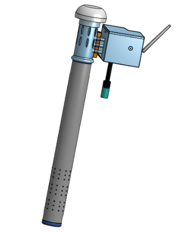
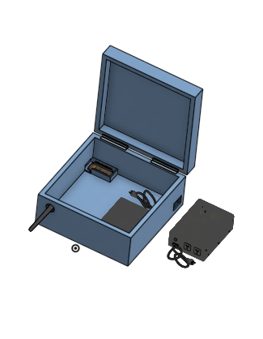

---

El dispositivo del proyecto preliminar ganador se basa en dos conceptos. En primer lugar, tenemos el que cumple el rol de transmitir, compuesto por sensores, batería, NRF24L01 (módulo transceptor), Arduino Uno y otros elementos. En segundo lugar, el que cumple el rol de recepción, compuesta por el módulo ESP32, NRF24L01, batería y una caja que los contiene.

A continuación, se mostrará de manera general dichos elementos:

<table>
  <tr>
    <td></td>
    <td></td>
  </tr>
</table>

***Figura:*** 
Dispositivo 1 al lado izquierdo 
(Rol: transmisión, sensores) y Dispositivo 2 al lado derecho 
(Rol: recepción, enviar datos a la nube).

[onshape](https://sketchfab.com/3d-models/my-model-ef1994cd2f934ea8ad02e61c87e12e4c)

Vista completa de las dos componentes en:
* [sketchfab](https://sketchfab.com/3d-models/my-model-composite-part-4-eb2148cdebaa42dea660bec73f28d02b)
* [repositorio](../../Hadware/Modelo_3D/Dispositivos.stl)

En estos links podrá visualizar nuestro dispositivo modo 3D: 

1. SKETCHFAB

* [Vista general 3D dispositivo #1](https://sketchfab.com/3d-models/all_my_model-8b4fa2704f744f1584f49b39e792a4b6)

* [Vista general 3D dispositivo #2 ](https://sketchfab.com/3d-models/caja-57ac736d35504cfc9fb07908c0be9ef0)

2. RESPOSITORIO

* [Vista general 3D dispositivo #1](../../Hadware/Modelo_3D/All_my_model.stl)

* [Vista general 3D dispositivo #2 ](../../Hadware/Modelo_3D/Caja_central.stl)

Del mismo modo, se puede visualizar sus componentes en SKETCHFAB:

* [Partes_dispositivo #1](https://sketchfab.com/3d-models/partes-mod-transmitir-f4738ec27411411494a5f1bcfd55df45)

* [Partes_dispositivo #2](https://sketchfab.com/3d-models/caja-3-838507ba5e3843d691f37436fab5a105)

O también puede visualizar las componentes desde nuestro repositorio: 

* [Componentes dispositivo #1](../../Hadware/Modelo_3D/Partes_mod_transmitir.stl)

* [Componentes dispositivo #2](../../Hadware/Modelo_3D/Caja_central.stl)

Finalmente, se presenta una breve representación de la ubicación donde se instalarán nuestros dispositivos en el entorno. 

