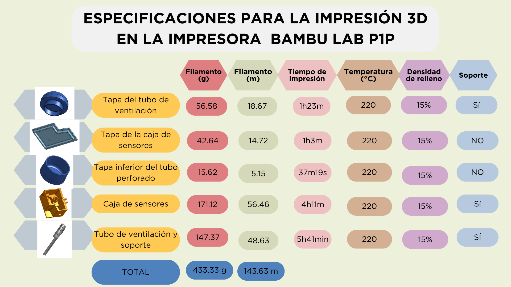
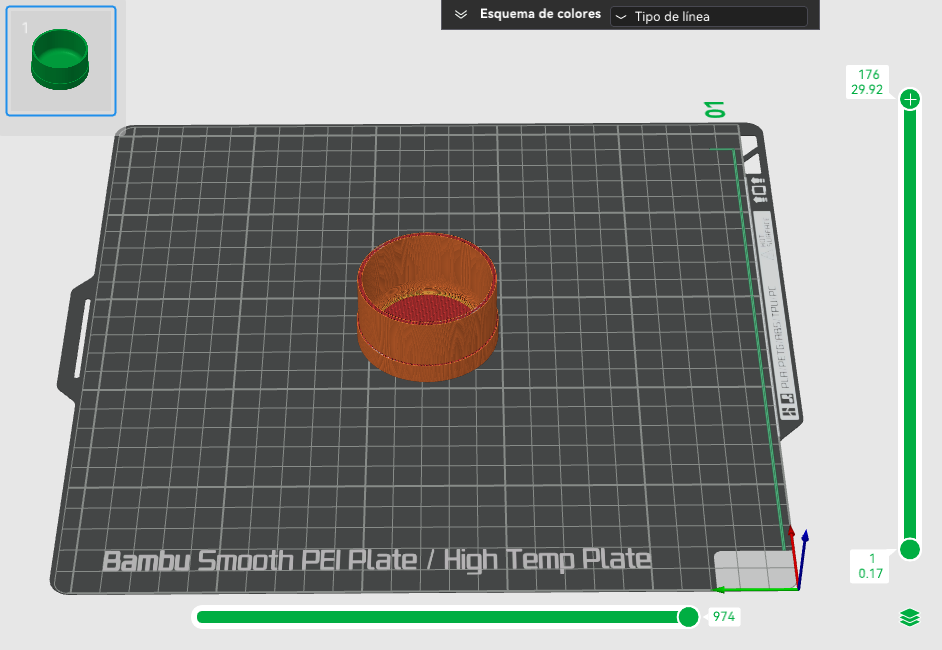

  En este entragable se han desarrollado diversos tipos de planos, especificando las medidas y la escala empleada en su 
  representación gráfica.
 

[ONSHAPE](https://cad.onshape.com/documents/abdf9a93153ae0cff690ce01/w/0f25dce1825e5c7b0e513c2e/e/e05ece0ddaee348aff5f31f4)

[ONSHAPE](https://cad.onshape.com/documents/abdf9a93153ae0cff690ce01/w/0f25dce1825e5c7b0e513c2e/e/41b6131b445da347f293c4ef)

.png)

[ONSHAPE](https://cad.onshape.com/documents/abdf9a93153ae0cff690ce01/w/0f25dce1825e5c7b0e513c2e/e/bebfb8ad76fc56d8f09fcbac)

.png)

[ONSHAPE](https://cad.onshape.com/documents/abdf9a93153ae0cff690ce01/w/0f25dce1825e5c7b0e513c2e/e/7b0b3b625309eafb34d392a6)

[ONSHAPE](https://cad.onshape.com/documents/abdf9a93153ae0cff690ce01/w/0f25dce1825e5c7b0e513c2e/e/75290495f1c6b86d3eabc5a4)

[ONSHAPE](https://cad.onshape.com/documents/abdf9a93153ae0cff690ce01/w/0f25dce1825e5c7b0e513c2e/e/806d9a40f8296d692cbd69cf)

[ONSHAPE](https://cad.onshape.com/documents/abdf9a93153ae0cff690ce01/w/0f25dce1825e5c7b0e513c2e/e/a92f1a1f2a5849794e21781a)

[ONSHAPE](https://cad.onshape.com/documents/7a7f94140b8d86c7ea033ef1/w/e999b315eef8267ad934f188/e/3a5b9aa109ccecf3491c6d49)

[Template formato fdx de la caja](https://github.com/Fx2048/Team_4_FdD/blob/main/Software/43454%20(1).dxf)

Para llevar a cabo la impresión 3D de nuestras componentes, se tomaron en cuenta las siguientes configuraciones en el programa Bambu_Studio, puesto que permite simular la impresión 3D y proporcionar información valiosa del seguimiento de dichas impresiones.

Se hizo lo siguiente:

+ Ajustes des sistema: Bambu Lab P1P 0.4 boquilla. 
+ Tipo de cama: alta temperatura de la placa.
+ Filamento: bambu PLA básico.
+ Altura de la capa: 1.7mm

+ [Tapa del tubo de ventilación](../../Hadware/Modelo_3D/Tapa_tubo_ventilacion_PLA_1h23m.gcode) 
+ [Tapa inferior del tubo perforado](../../Hadware/Modelo_3D/Tapa_inferior_tubo_PLA_37m19s.gcode) 
+ [Tapa de la caja de sensores](../../Hadware/Modelo_3D/Tapa_caja_sensores_PLA_1h3m.gcode) 
+ [Tubo de ventilación](../../Hadware/Modelo_3D/Parte_tubo_ventilacion_PLA_5h41m.gcode) 
+ [Caja de control de sensores](../../Hadware/Modelo_3D/Caja_control_sensores_PLA_4h11m.gcode) 

+  
+  
+  
+  
+  
