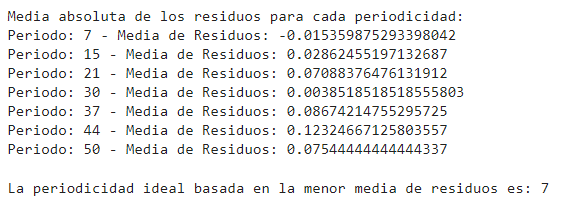
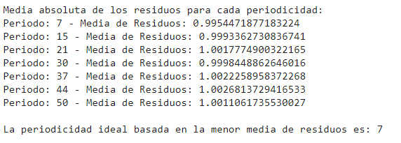
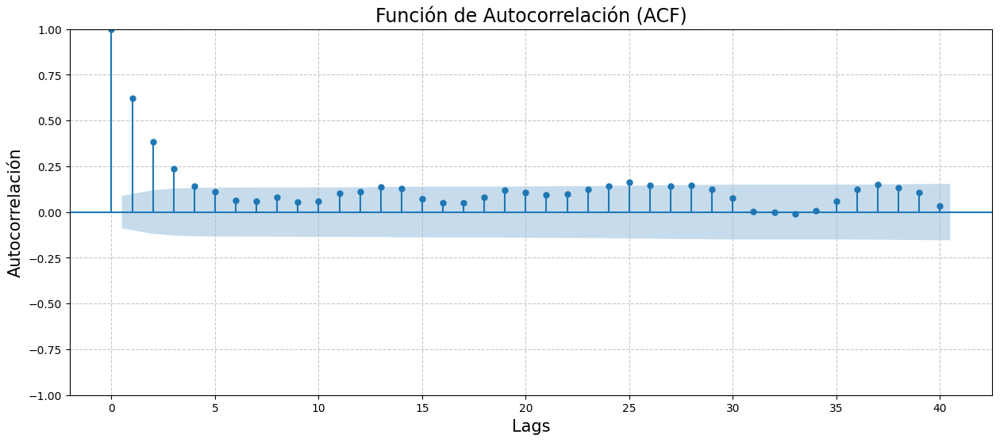
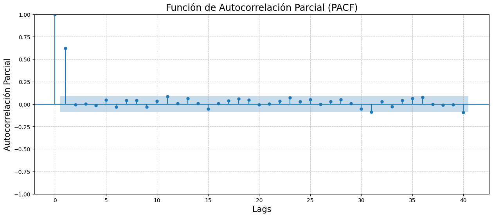
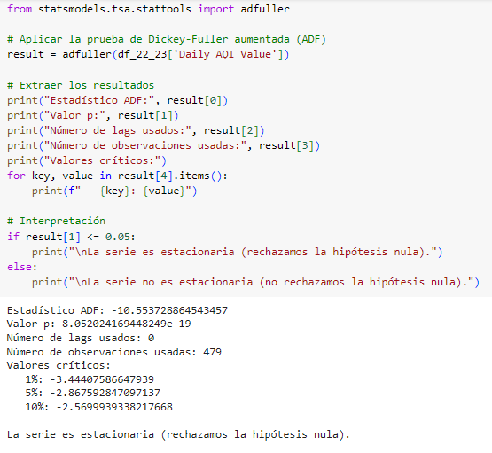
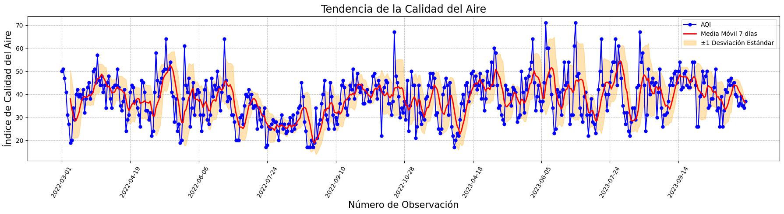

# Tema:
### Regresión en aprendizaje automático para predecir la concentración de ozono en el Condado de Baldwin, Alabama, EE.UU., basada en registros de 2022-2023

# **Curso:**
### Proyectos de Ingeniería 1

# **Integrantes:**
- Llanos Angeles Leily Marlith
- Luque Mamani Magno Ricardo
- Mendoz Villar Antony Iván
- Quispe Baldeon Melissa

# **Docentes:**
- Umbert Lewis de la Cruz Rodríguez
- Renzo Jose Chan Rios
- Marcos Miguel Retamozo Ramos
- Moisés Stevend Meza Rodríguez
- Harry Anderson Rivera Tito
- Pierre Giovanny Ramos Apestegui

#
#

## **1. Introducción**

La calidad del aire es un tema de creciente preocupación a nivel global, especialmente en entornos urbanos donde la contaminación puede tener efectos adversos significativos en la salud pública y el medio ambiente. Entre los contaminantes atmosféricos, el ozono troposférico es un elemento crítico, ya que niveles elevados de este gas pueden provocar problemas respiratorios y contribuir a enfermedades cardiovasculares. Este informe se centra en el análisis de los niveles de ozono en el Condado de Baldwin, Alabama, durante los años 2022 y 2023, con el objetivo de predecir su comportamiento en los meses siguientes.

Para llevar a cabo esta predicción, se ha empleado la regresión lineal con series temporales, una técnica avanzada de análisis que permite modelar y predecir patrones en datos cronológicos. A diferencia de la regresión lineal tradicional, que establece una relación lineal entre una variable dependiente y una o más variables independientes, la regresión de series temporales utiliza datos históricos para identificar tendencias y patrones a lo largo del tiempo. Este enfoque es particularmente útil para entender cómo varían los niveles de ozono en función de múltiples factores temporales y predecir su evolución futura.

El informe se estructura en varias secciones: comienza con la metodología utilizada para el análisis, seguida de los resultados obtenidos y concluye con una discusión de los hallazgos y recomendaciones basadas en el comportamiento proyectado de los niveles de ozono en el Condado de Baldwin.

## **2. Metodología**

Nuestro modelo predictivo se basa en la implementación de técnicas de series temporales, que se incluirá el siguiente enfoque:  Retardos como regresores de un modelo (Alonso Rodriguez, 2021). Es importante señalar que, para llevar a cabo la predicción de un modelo, es necesario que los datos de entrenamiento estén bien preparados, para así aplicar estas técnicas de manera adecuada y capturar patrones en los datos temporales.

Las etapas se basaron en los siguientes:

### 2.1 Obtención de los datos:
En esta etapa se obtuvieron los DataFrames de la base de datos de la Agencia de Protección Ambiental de Estados Unidos (EPA), específicamente, información de la calidad de aire de los años 2022 y 2023 en el Condado de Baldwin, Alabama, EE. UU. En esta, se registraron datos diarios correspondiente al estado del aire exterior para el Ozono como contaminante. 

### 2.2 Preparación de los datos:
En esta etapa, se observó que la información de los valores únicos de cada columna, podemos notar que hay valores que se repiten, ya sea del tipo objeto, entero o flotante, y por ende procedemos a eliminar las columnas que no aportan  información valiosa para el entrenamiento de nuestro modelo.

### 2.3 Extracción de características:
A continuación, se puede visualizar la matriz de correlación tomando las columnas del tipo de dato numérico y que serán útiles:

Podemos observar que las dos características "Daily Max 8-hour Ozone Concentration" y "Daily AQI Value" tienen una fuerte correlación entre sí, mientras que las demás características presentan una correlación muy baja. Si comparamos la correlación de estas dos primeras características con las demás que no muestran una buena correlación, podemos notar que la columna "Daily AQI Value" presenta una ligera mejor correlación en comparación con la columna "Daily Max 8-hour Ozone Concentration". 

#### 2.3.1 Análisis de Datos y Modelado

Teniendo en cuenta los datos exportados, se han seleccionado únicamente las variables que varían en el tiempo. Los valores constantes, ya sean enteros (int), flotantes (float) u objetos, se eliminaron para facilitar un mejor análisis de los datos. Esto resultó en la selección de cuatro variables claves: Daily Max 8-hour Ozone Concentration, Daily AQI Value, Daily Obs Count y Percent Complete. Se realizó una correlación entre estas variables para identificar cuál utilizar como variable objetivo, eligiendo a Daily AQI Value. A partir de esta selección, se trabajó en función de tiempo (días de cada mes desde marzo a octubre, durante los años 2022 y 2023) para analizar las tendencias.

De acuerdo al gráfico, se observó que los valores presentan fluctuaciones significativas, sin seguir una línea constante, lo cual no es coherente con una medida diaria estable. Por esta razón, se decidió elaborar un gráfico de caja y bigote para identificar qué datos contienen una mayor cantidad de valores atípicos.

#### 2.3.2 Gráfico caja y bigote

En el gráfico resultante se observó que en el año 2023 hay un índice un poco mayor de valores atípicos. Con esta información, se procedió a calcular el percentil de los datos. Los valores atípicos fueron inicialmente reemplazados por el percentil 90% debido a que se encontraban significativamente por encima de la mediana. Tras esta modificación, se generó un nuevo gráfico del índice de calidad de aire, que mostró una disminución notable. Sin embargo, al analizar más detenidamente la gráfica, se decidió reemplazar los valores atípicos por el percentil 50%, lo que representa la mediana. Esta estrategia resultó en una mejora más pronunciada en nuestra data, ya que redujo significativamente los valores atípicos, proporcionando una relación más consistente entre la variable objetivo y los valores observados. 

#### 2.3.3 Visualización de los datos

Una vez preparado el conjunto de datos, se procedió al modelado aplicando regresión lineal con series temporales. Es un tipo de análisis de regresión que modela la relación entre una variable dependiente y una o más variables independientes, para lo cual se utiliza datos que se ordenan cronológicamente, lo cual ayuda a entender cómo cambia la variable dependiente a través del tiempo (Hyndman y Athanasopoulos, 2018). Por lo cual, la función de regresión representa nuestra variable objetivo en función del tiempo, comenzando desde el 0 y avanzando dependiendo del número de observaciones disponibles.

## Descomposición de la Serie Temporal sin Dependencia del Tiempo

La serie observada en color azul muestra las mediciones originales de calidad del aire a lo largo del tiempo. En esta gráfica, se pueden notar fluctuaciones significativas que indican que los valores de calidad del aire no son constantes, sino que varían considerablemente. 

Tendencia: La línea roja representa la tendencia a largo plazo de la serie temporal. Se puede observar que la tendencia no es constante; en los primeros meses, hay un descenso gradual, lo que sugiere un empeoramiento de la calidad del aire. Posteriormente, la tendencia muestra un aumento, indicando una mejora en la calidad del aire, seguido de otro descenso hacia el final del periodo. Estos cambios en la tendencia pueden reflejar variaciones estacionales más amplias o eventos específicos que afectaron la calidad del aire en esos períodos.

Estacionalidad: La componente estacional, mostrada en color verde, captura patrones que se repiten en intervalos regulares de tiempo. En el gráfico, se observa un patrón estacional claro, lo que sugiere que hay ciclos repetitivos en la calidad del aire. 

Residuos: La serie de residuos en color negro representa la parte de la serie temporal que no puede ser explicada por la tendencia ni la estacionalidad. Estos residuos parecen estar distribuidos de manera aleatoria alrededor de cero, sin un patrón aparente. Esto es un buen indicador de que la descomposición ha capturado adecuadamente las componentes de tendencia y estacionalidad, dejando sólo el "ruido" o variaciones aleatorias en los residuos.

A partir del análisis de la descomposición de la serie temporal de calidad del aire, se puede concluir que la serie presenta tanto tendencia como estacionalidad. La tendencia muestra variaciones en la calidad del aire a lo largo del tiempo, lo cual podría estar asociado a cambios estacionales amplios o eventos específicos. 

## Modelo “Aditivo”

## Modelo “Multiplicativo”

Dado que ambos modelos tienen la menor media de residuos en el periodo de 7, nos basaremos en elegir el modelo aditivo porque la amplitud de la estacionalidad es constante.

## ESTACIONARIEDAD

Basándonos en la función de autocorrelación (ACF), podemos observar cómo se comportan las autocorrelaciones en diferentes rezagos (lags):

Autocorrelación Alta en Lags Bajos: En la gráfica, se observa una alta autocorrelación en los primeros lags, lo cual es común en series no estacionarias. Esto indica una fuerte relación entre los valores cercanos en el tiempo.

Decaimiento Lento: La autocorrelación no disminuye rápidamente a cero, lo que sugiere que la serie puede tener una tendencia o una componente estacional, características de una serie no estacionaria.

Comportamiento Aleatorio en Lags Altos: La mayoría de las autocorrelaciones en lags más altos están dentro del intervalo de confianza (el área sombreada), lo que podría indicar que no hay correlación significativa en esos lags.

La gráfica de la Función de Autocorrelación Parcial (PACF) muestra la relación entre los valores de una serie temporal y sus rezagos, destacando que el primer lag tiene una alta correlación, lo que indica una fuerte dependencia del valor actual respecto al anterior. A medida que se incrementan los lags, los valores de autocorrelación parcial disminuyen rápidamente y se estabilizan en torno a cero, sugiriendo que no hay correlaciones significativas en rezagos posteriores. 

Dado que el estadístico ADF es mucho menor que los valores críticos y el valor p es significativamente menor que 0.05, podemos rechazar la hipótesis nula. Esto indica que la serie es estacionaria.

Por lo tanto, no necesitas aplicar transformaciones adicionales (como diferenciación) para hacerla estacionaria antes de ajustar tu modelo de regresión. Puedes proceder con el modelado sabiendo que la serie no tiene tendencia ni estacionalidad que deban ser corregidas.

La visualización utilizando una media móvil de 7 días para el Índice de Calidad del Aire (AQI) es efectiva para destacar la tendencia general en los datos, suavizando las variaciones diarias que pueden oscurecer patrones importantes. Las bandas de ±1 desviación estándar alrededor de la media móvil son particularmente útiles para visualizar la variabilidad y detectar periodos de mayor o menor volatilidad en la calidad del aire. Además, la inclusión de puntos marcadores en los datos originales facilita la correlación entre eventos específicos y los valores de AQI.

Para mejorar el análisis, se podría considerar ajustar la ventana de la media móvil para explorar tendencias a largo plazo con mayor profundidad, utilizando ventanas más amplias como 14 o 30 días. También sería valioso incorporar un análisis estacional para descomponer las series temporales en sus componentes de tendencia, estacionalidad y ruido, lo que podría proporcionar una visión más detallada de cómo varía la calidad del aire en función de las estaciones. Comparar las tendencias con datos de años anteriores permitiría evaluar cambios a largo plazo y el impacto de políticas ambientales.

## **3. Resultados**

De acuerdo a las implementaciones realizadas, ahora es posible observar las proyecciones futuras de las mediciones de calidad del aire y esto juega muy importante el análisis y la predicción de series temporales, ya que estos va a permitir entender mejor los patrones y tendencia de datos ambientales como los índices de la calidad del aire. Esta capacidad de predecir futuras mediciones es crucial para la planificación y la implementación de estrategias de mitigación de la contaminación atmosférica. Por lo cuál según Rahman et al. (2016), la elección adecuada de retrasos en los modelos de series temporales mejora significativamente la precisión de las predicciones, lo que es fundamental para evaluar el impacto potencial de las políticas ambientales.Como se puede observar a continuación, experimentamos con tres modelos: 
El primer modelo de XGBoost, configurado con sus parámetros predeterminados, logró un rendimiento sólido, obteniendo una RMSE de 8.91 y un R² de 0.64. Esto indica que el modelo capturó bien las variaciones en los datos, proporcionando predicciones precisas sin necesidad de ajustes adicionales. La baja RMSE y el R² razonablemente alto muestran que el modelo base de XGBoost fue efectivo en explicar la variabilidad en la calidad del aire, representando un buen punto de partida.

Al intentar mejorar el rendimiento mediante la optimización de hiperparámetros con GridSearchCV, se observó un ligero deterioro, con la RMSE aumentando a 9.07 y el R² disminuyendo a 0.63. Esto sugiere que la optimización no siempre garantiza mejoras y, en este caso, podría haber llevado a un sobreajuste o a la selección de hiperparámetros menos adecuados para los datos.

El modelo RandomForestRegressor, optimizado con RandomizedSearchCV, obtuvo resultados similares al modelo optimizado de XGBoost, con una RMSE de 9.05 y un R² de 0.63. Aunque RandomForest es una técnica robusta, no superó al modelo base de XGBoost en este caso, lo que resalta la importancia de evaluar modelos básicos antes de proceder con optimizaciones. En general, aunque la optimización no mejoró los resultados, tanto XGBoost como RandomForest siguen siendo enfoques valiosos, especialmente cuando se busca equilibrar precisión y eficiencia computacional.

## **4. Discusión**

Los datos analizados reflejan la calidad del aire, específicamente en relación con los niveles de ozono, en Fairhope, Alabama, desde marzo de 2022 hasta octubre de 2023. Este periodo abarca diversas condiciones climáticas y actividades humanas que pueden influir en la calidad del aire, lo que permite una evaluación significativa de las tendencias y patrones en la contaminación por ozono.

Los valores de AQI observados en el periodo analizado muestran una variabilidad considerable. Comenzando en marzo de 2022 con un AQI de 50, que indica una calidad del aire moderada, se registraron fluctuaciones en los días siguientes, alcanzando un pico de 58 el 4 de marzo. Esta variabilidad puede atribuirse a factores estacionales, como el aumento de la temperatura y la radiación solar, que son propensos a incrementar la formación de ozono a nivel del suelo.

Durante octubre de 2023, los valores de AQI oscilaron entre 34 y 39, lo que sugiere una mejora en la calidad del aire en comparación con los niveles más altos observados en 2022. Estos valores más bajos son alentadores y podrían reflejar una reducción en las fuentes de emisión de ozono.

En la evaluación de los modelos, el XGBoost configurado con parámetros predeterminados mostró un rendimiento superior en comparación con las versiones optimizadas y el RandomForestRegressor, lo que sugiere que la complejidad adicional de la optimización de hiperparámetros no siempre resulta en mejoras significativas. El hecho de que la optimización con GridSearchCV empeora levemente el rendimiento del XGBoost indica que una selección cuidadosa de los hiperparámetros es crucial, y que, en algunos casos, un modelo base bien configurado puede ser más efectivo. Por otro lado, aunque el RandomForestRegressor optimizado no superó al XGBoost, sus resultados competitivos resaltan su utilidad como una herramienta robusta, especialmente cuando se busca un equilibrio entre precisión y eficiencia. Este análisis subraya la importancia de evaluar los modelos base antes de recurrir a técnicas más complejas, ya que los beneficios de la optimización no siempre son garantizados.
 

## **Conclusión:**
En conclusión, el análisis y modelado de la calidad del aire en el Condado de Baldwin, Alabama, durante 2022 y 2023, han revelado la eficacia de los modelos de regresión para predecir los niveles de ozono. El XGBoost, con sus parámetros predeterminados, demostró ser el modelo más eficaz, subrayando que una buena configuración inicial puede superar a versiones optimizadas o modelos alternativos como RandomForest. Además, la variabilidad observada en los niveles de AQI resalta la influencia de factores estacionales y climáticos en la calidad del aire. Estos hallazgos son valiosos para la implementación de estrategias de mitigación que aborden la contaminación atmosférica y protejan la salud pública.

## **6. Referencias [en IEEE]**

+ [1] I. Lee, “Series de Tiempo: Forecasting con XGBoost,” *Medium*, Apr. 10, 2023. [En línea]. Disponible: https://ivan-lee.medium.com/series-de-tiempo-con-xgboost-f732f1da3056. [Accedido: Ago. 25, 2024].

+ [2] R. Holbrook, "Time Series," *Kaggle*. [En línea]. Disponible: https://www.kaggle.com/learn/time-series. [Accedido: Ago. 25, 2024].

+ [3] Alabama Department of Environmental Management, "2023 Annual Ambient Air Quality Monitoring Plan," Jul. 26, 2023. [En línea]. Disponible: https://adem.alabama.gov/programs/air/airquality/2023AmbientAirPlan.pdf. [Accedido: Ago. 25, 2024].

+ [4] Alabama Department of Environmental Management, "2022 Ambient Air Monitoring Network Plan," Jul. 01, 2022. [En línea]. Disponible: https://adem.alabama.gov/programs/air/airquality/2022AmbientAirPlan.pdf. [Accedido: Ago. 25, 2024].

+ [5] A. Ospina Montoya y M. A. Garrido Tamayo, "Técnicas de medición de ozono: Métodos tradicionales frente al método de cámara de absorción con led ultravioleta como fuente de luz," *Gestión y Ambiente*, vol. 16, no. 2, pp. 95-104, ago. 2013. Disponible en: https://www.redalyc.org/articulo.oa?id=16942824020008. [Accedido: Ago. 25, 2024].

+ [6] A. Alonso-Rodriguez, "La predicción de series temporales mediante el modelo de regresión," *AJEE*, no. 54, pp. 261–280, mar. 2021.

+ [7] C. Monardes, “Análisis de Series de Tiempo y Pronósticos,” *Youtube*, Feb. 9, 2022. [Archivo de Vídeo]. Disponible: https://www.youtube.com/watch?v=aUwXWGa8jK0.

+ [8] Codificando Bits, “Tutorial: ¿Cómo DESCOMPONER una serie de tiempo?” *Youtube*, Apr. 22, 2024. [Archivo de Vídeo]. Disponible: https://www.youtube.com/watch?v=aUwXWGa8jK0.

+ [9] K. Rojas-Jimenez, "Capítulo 8 análisis de series de tiempo," *Bookdown.org*. [En línea]. Disponible: https://bookdown.org/keilor_rojas/CienciaDatos/an%C3%A1lisis-de-series-de-tiempo.html. [Accedido: Ago. 26, 2024].

+ [10] (S/f). "Tema 6 EctrGrado," *Ucm.es*. [En línea]. Disponible: https://www.ucm.es/data/cont/docs/518-2013-10-25-Tema_6_EctrGrado.pdf. [Accedido: Ago. 26, 2024].

