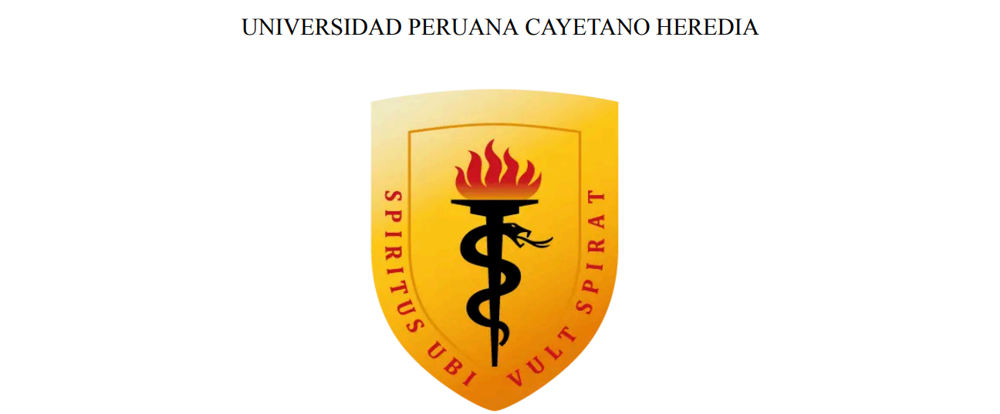

# Tema:
### Regresión en aprendizaje automático para predecir la concentración de ozono en el Condado de Baldwin, Alabama, EE.UU., basada en registros de 2022-2023

# **Curso:**
### Proyectos de Ingeniería 1

# **Integrantes:**
- Llanos Angeles Leily Marlith
- Luque Mamani Magno Ricardo
- Mendoz Villar Antony Iván
- Quispe Baldeon Melissa

# **Docentes:**
- Umbert Lewis de la Cruz Rodríguez
- Renzo Jose Chan Rios
- Marcos Miguel Retamozo Ramos
- Moisés Stevend Meza Rodríguez
- Harry Anderson Rivera Tito
- Pierre Giovanny Ramos Apestegui

#
#

## **1. Introducción**

La calidad del aire se ha convertido en un tema de creciente preocupación a nivel global, especialmente en entornos urbanos donde la contaminación puede tener efectos adversos significativos en la salud pública y el medio ambiente. Entre los contaminantes atmosféricos, la concentración de ozono troposférico se destaca como un elemento crítico, ya que niveles elevados de este gas pueden provocar problemas respiratorios y contribuir a enfermedades cardiovasculares. Este informe se centra en el análisis de los niveles de ozono en el Condado de Baldwin, Alabama, durante los años 2022 y 2023, con el objetivo de predecir su comportamiento en los meses siguientes.

Para llevar a cabo esta predicción, se emplea la regresión lineal, una técnica de machine learning que permite modelar la relación entre variables y realizar inferencias sobre datos futuros. La regresión lineal es un método estadístico que busca establecer una relación lineal entre una variable dependiente y una o más variables independientes, facilitando la comprensión de cómo diferentes factores pueden influir en la calidad del aire.

El informe se estructura en varias secciones: comienza con la metodología utilizada para el análisis, seguido de los resultados obtenidos, y concluye con una discusión de los hallazgos y recomendaciones.

## **2. Metodología**

Nuestro modelo predictivo se basa en la implementación de técnicas de series temporales, que se incluirá el siguiente enfoque: función de paso de tiempo (Alonso Rodriguez, 2021). Es importante señalar que, para llevar a cabo la predicción de un modelo, es necesario que los datos de entrenamiento estén bien preparados, para así aplicar estas técnicas de manera adecuada y capturar patrones en los datos temporales.

Las etapas se basaron en los siguientes:

### 2.1 Obtención de los datos:
En esta etapa se obtuvieron los DataFrames de la base de datos de la Agencia de Protección Ambiental de Estados Unidos (EPA), específicamente, información de la calidad de aire de los años 2022 y 2023 en el Condado de Baldwin, Alabama, EE. UU. En esta, se registraron datos diarios correspondiente al estado del aire exterior para el Ozono como contaminante. 

### 2.2 Preparación de los datos:
En esta etapa, se observó que la información de los valores únicos de cada columna, podemos notar que hay valores que se repiten, ya sea del tipo objeto, entero o flotante, y por ende procedemos a eliminar las columnas que no aportan  información valiosa para nuestro modelo. En la siguiente imagen podemos visualizar las características que  no son de valor único.

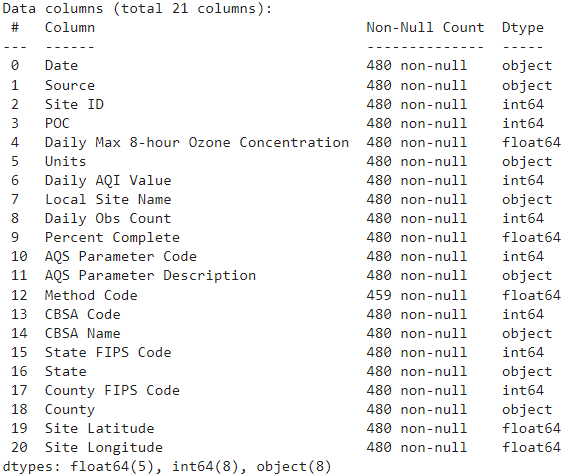

### 2.3 Extracción de características:
A continuación, se puede visualizar la matriz de correlación tomando las columnas del tipo de dato numérico.

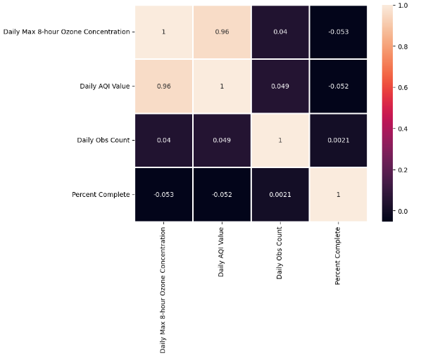

Podemos observar que las dos características "Daily Max 8-hour Ozone Concentration" y "Daily AQI Value" tienen una fuerte correlación entre sí, mientras que las demás características presentan una correlación muy baja. Si comparamos la correlación de estas dos primeras características con las demás que no muestran una buena correlación, podemos notar que la columna "Daily AQI Value" presenta una ligera mejor correlación en comparación con la columna "Daily Max 8-hour Ozone Concentration". 

#### 2.3.1 Análisis de Datos y Modelado

Teniendo en cuenta los datos exportados, se han seleccionado únicamente las variables que varían en el tiempo. Los valores constantes, ya sean enteros (int), flotantes (float) u objetos, se eliminaron para facilitar un mejor análisis de los datos. Esto resultó en la selección de cuatro variables claves: Daily Max 8-hour Ozone Concentration, Daily AQI Value, Daily Obs Count y Percent Complete. Se realizó una correlación entre estas variables para identificar cuál utilizar como variable objetivo, eligiendo a Daily AQI Value. A partir de esta selección, se trabajó en función de tiempo (días de cada mes desde marzo a octubre, durante los años 2022 y 2023) para analizar las tendencias.

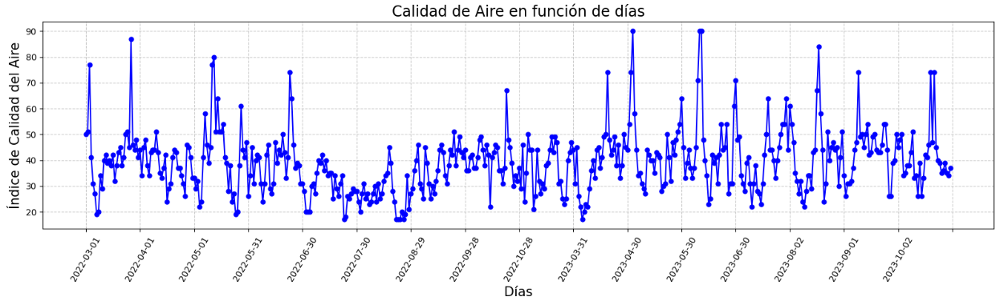

De acuerdo al gráfico, se observó que los valores presentan fluctuaciones significativas, sin seguir una línea constante, lo cual no es coherente con una medida diaria estable. Por esta razón, se decidió elaborar un gráfico de caja y bigote para identificar qué datos contienen una mayor cantidad de valores atípicos.

#### 2.3.2 Gráfico caja y bigote

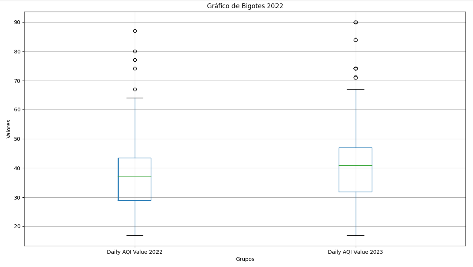

En el gráfico resultante se observó que en el año 2023 hay un índice un poco mayor de valores atípicos. Con esta información, se procedió a calcular el percentil de los datos. Los valores atípicos fueron inicialmente reemplazados por el percentil 90% debido a que se encontraban significativamente por encima de la mediana. Tras esta modificación, se generó un nuevo gráfico del índice de calidad de aire, que mostró una disminución notable. Sin embargo, al analizar más detenidamente la gráfica, se decidió reemplazar los valores atípicos por el percentil 50%, lo que representa la mediana. Esta estrategia resultó en una mejora más pronunciada en nuestra data, ya que redujo significativamente los valores atípicos, proporcionando una relación más consistente entre la variable objetivo y los valores observados. 

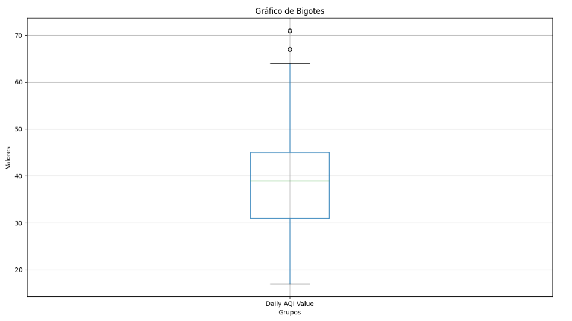

#### 2.3.3 Visualización de los datos

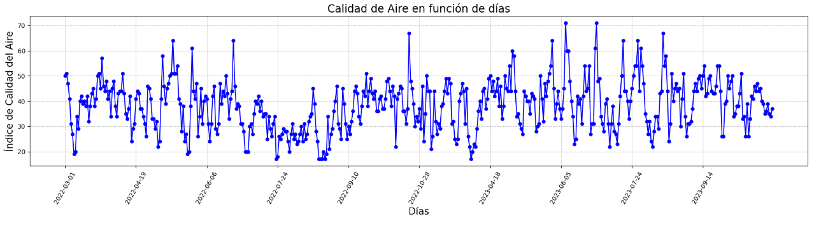

Una vez preparado el conjunto de datos, se procedió al modelado aplicando regresión lineal con series temporales. Es un tipo de análisis de regresión que modela la relación entre una variable dependiente y una o más variables independientes, para lo cual se utiliza datos que se ordenan cronológicamente, lo cual ayuda a entender cómo cambia la variable dependiente a través del tiempo (Hyndman y Athanasopoulos, 2018). Por lo cual, la función de regresión representa nuestra variable objetivo en función del tiempo, comenzando desde el 0 y avanzando dependiendo del número de observaciones disponibles.

## Descomposición de la Serie Temporal sin Dependencia del Tiempo

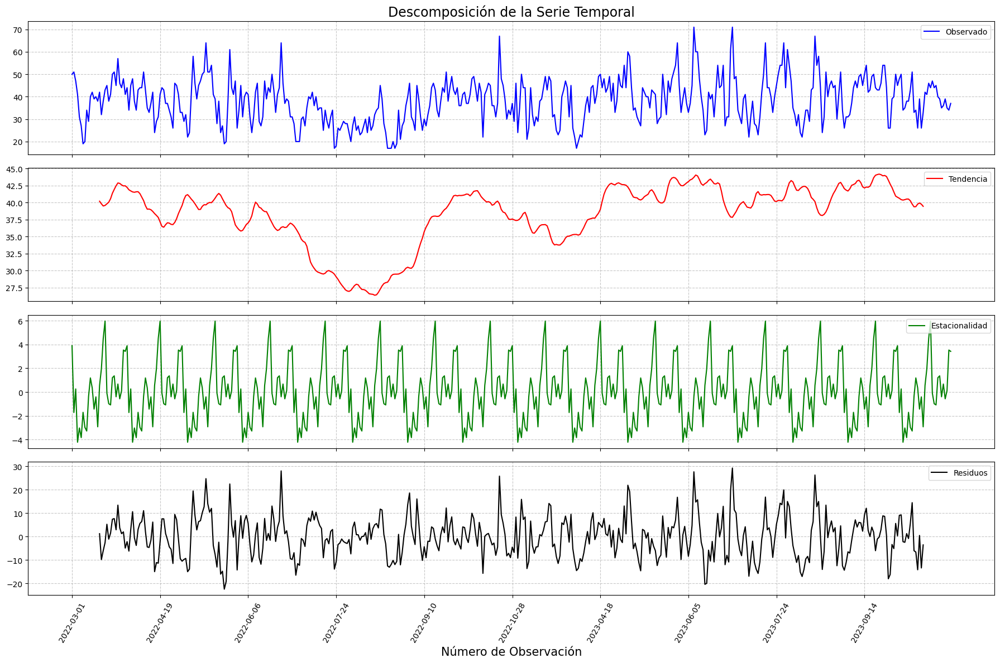

La serie observada en color azul muestra las mediciones originales de calidad del aire a lo largo del tiempo. En esta gráfica, se pueden notar fluctuaciones significativas que indican que los valores de calidad del aire no son constantes, sino que varían considerablemente. 

Tendencia: La línea roja representa la tendencia a largo plazo de la serie temporal. Se puede observar que la tendencia no es constante; en los primeros meses, hay un descenso gradual, lo que sugiere un empeoramiento de la calidad del aire. Posteriormente, la tendencia muestra un aumento, indicando una mejora en la calidad del aire, seguido de otro descenso hacia el final del periodo. Estos cambios en la tendencia pueden reflejar variaciones estacionales más amplias o eventos específicos que afectaron la calidad del aire en esos períodos.

Estacionalidad: La componente estacional, mostrada en color verde, captura patrones que se repiten en intervalos regulares de tiempo. En el gráfico, se observa un patrón estacional claro, lo que sugiere que hay ciclos repetitivos en la calidad del aire. 
Residuos: La serie de residuos en color negro representa la parte de la serie temporal que no puede ser explicada por la tendencia ni la estacionalidad. Estos residuos parecen estar distribuidos de manera aleatoria alrededor de cero, sin un patrón aparente. Esto es un buen indicador de que la descomposición ha capturado adecuadamente las componentes de tendencia y estacionalidad, dejando sólo el "ruido" o variaciones aleatorias en los residuos.
A partir del análisis de la descomposición de la serie temporal de calidad del aire, se puede concluir que la serie presenta tanto tendencia como estacionalidad. La tendencia muestra variaciones en la calidad del aire a lo largo del tiempo, lo cual podría estar asociado a cambios estacionales amplios o eventos específicos.

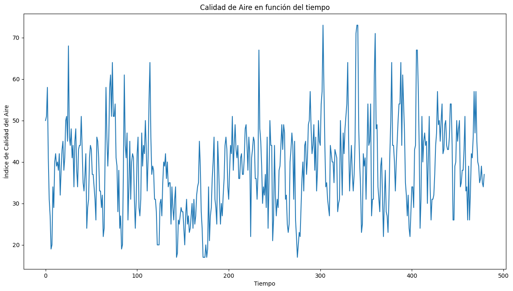

Para mejorar el modelo, se implementaron funciones de retraso, las cuales consisten en cambiar las observaciones de la serie objetivo para que aparezca más tarde en el tiempo. Esta técnica permite capturar la relación de la relación de las observaciones actuales con las anteriores.

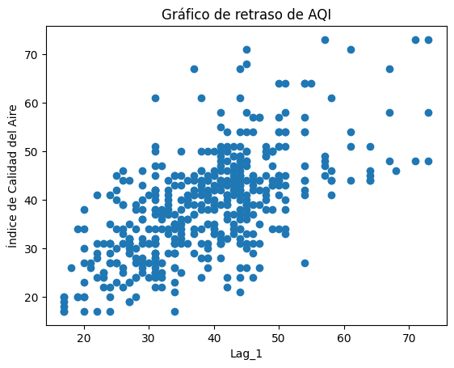

Una vez realizada la primera función de retraso, procedemos a graficar y verificar los respectivos datos en función del tiempo y de esa manera verificar su linealidad.

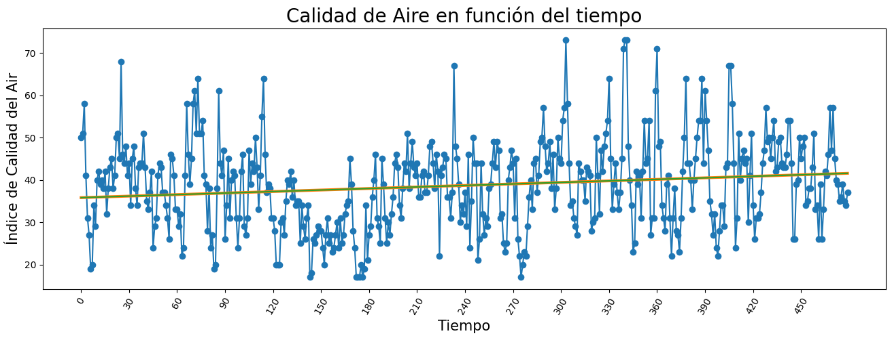

Seguidamente se procede a implementar la segunda técnica de retraso y graficarlo para que de esa manera se pueda graficar correctamente.

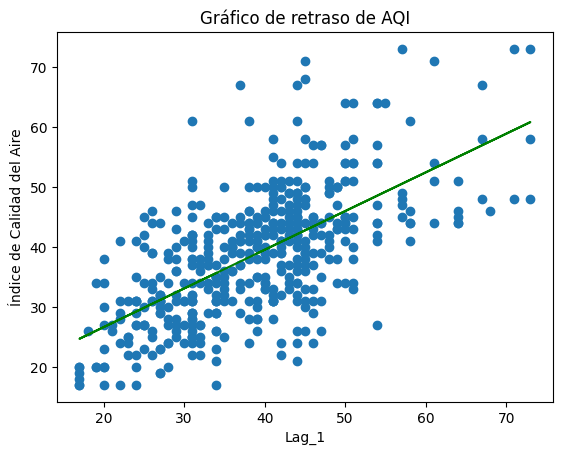

También, procedemos a sacar la media considerando los meses de cada año que esto nos permitirá a predecir el futuro teniendo en cuenta nuestro modelo, por lo cual se está usando las series temporales

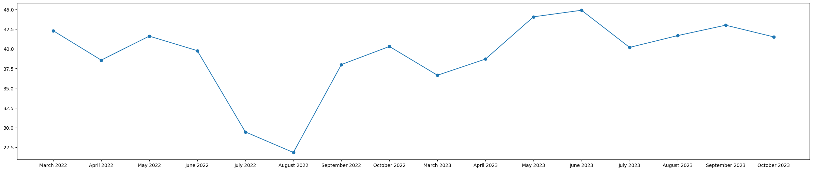

Una vez contada con nuestro modelo de regresión procedemos a ejecutar para de esa manera poder predecir los resultados futuros.

## **3. Resultados**

De acuerdo a las implementaciones realizadas, ahora es posible observar las proyecciones futuras de las mediciones de calidad del aire para los meses de marzo y octubre del año 2024. Los resultados obtenidos muestran que los valores del Índice de Calidad del Aire (AQI) se mantienen dentro de un rango constante entre 30 y 50. Estos valores indican una tendencia ascendente a lo largo de estos meses, sugiriendo que la calidad del aire puede estar deteriorándose progresivamente durante este periodo. Y en todo esto jugó un papel muy importante el análisis y la predicción de series temporales, ya que estos va a permitir entender mejor los patrones y tendencia de datos ambientales como los índices de la calidad del aire. Esta capacidad de predecir futuras mediciones es crucial para la planificación y la implementación de estrategias de mitigación de la contaminación atmosférica. Por lo cuál según Rahman et al. (2016), la elección adecuada de retrasos en los modelos de series temporales mejora significativamente la precisión de las predicciones, lo que es fundamental para evaluar el impacto potencial de las políticas ambientales.

## **4. Discusión**

Los datos analizados reflejan la calidad del aire, específicamente en relación con los niveles de ozono, en Fairhope, Alabama, desde marzo de 2022 hasta octubre de 2023. Este periodo abarca diversas condiciones climáticas y actividades humanas que pueden influir en la calidad del aire, lo que permite una evaluación significativa de las tendencias y patrones en la contaminación por ozono.

Los valores de AQI observados en el periodo analizado muestran una variabilidad considerable. Comenzando en marzo de 2022 con un AQI de 50, que indica una calidad del aire moderada, se registraron fluctuaciones en los días siguientes, alcanzando un pico de 58 el 4 de marzo. Esta variabilidad puede atribuirse a factores estacionales, como el aumento de la temperatura y la radiación solar, que son propensos a incrementar la formación de ozono a nivel del suelo.

Durante octubre de 2023, los valores de AQI oscilaron entre 34 y 39, lo que sugiere una mejora en la calidad del aire en comparación con los niveles más altos observados en 2022. Estos valores más bajos son alentadores y podrían reflejar una reducción en las fuentes de emisión de ozono, como el tráfico vehicular o las actividades industriales, así como una mayor conciencia pública sobre la contaminación del aire.

Los datos de calidad del aire para el año 2024 muestran una tendencia preocupante que merece atención. Las predicciones indican que, a partir de marzo, los niveles de calidad del aire se mantienen relativamente estables, con valores que oscilan entre 41.55 y 41.60. Sin embargo, a medida que avanzamos hacia octubre, se observa un aumento significativo en las predicciones, alcanzando valores superiores a 44.43. En conclusión, los datos de 2024 sugieren que, sin una intervención adecuada, podríamos enfrentar un deterioro continuo en la calidad del aire. 

## **Conclusión:**
El análisis de la calidad del aire en Fairhope, Alabama, revela tendencias importantes en la contaminación por ozono que requieren atención continua. La variabilidad en los niveles de AQI destaca la necesidad de una vigilancia constante y la implementación de estrategias efectivas para proteger la salud pública y mejorar la calidad del aire en la región./

## **6. Referencias [en IEEE]**

- [1] I. Lee, “Series de Tiempo: Forecasting con XGBoost,” Medium, Apr. 10, 2023. [En Línea] . Disponible:  https://ivan-lee.medium.com/series-de-tiempo-con-xgboost-f732f1da3056.  [Accedido: Ago. 25, 2024].

- [2]R. Holbrook, "Time Series," Kaggle. [En línea]. Disponible: https://www.kaggle.com/learn/time-series.  [Accedido: Ago. 25, 2024].

- [3] Alabama Department of Environmental Management, "2023 Annual Ambient Air Quality Monitoring Plan," Jul. 26, 2023. [En línea]. Disponible: https://adem.alabama.gov/programs/air/airquality/2023AmbientAirPlan.pdf. [Accedido: Ago. 25, 2024].

- [4] Alabama Department of Environmental Management, "2022 Ambient Air Monitoring Network Plan," Jul. 01, 2022. [En línea]. Disponible: https://adem.alabama.gov/programs/air/airquality/2022AmbientAirPlan.pdf. [Accedido: Ago. 25, 2024].

- [5] A. Ospina Montoya y M. A. Garrido Tamayo, "Técnicas de medición de ozono: Métodos tradicionales frente al método de cámara de absorción con led ultravioleta como fuente de luz," Gestión y Ambiente, vol. 16, no. 2, pp. 95-104, ago. 2013. Disponible en: https://www.redalyc.org/articulo.oa?id=16942824020008. [Accedido: Ago. 25, 2024].
 
- [6] A. Alonso-Rodriguez, «La predicción de series temporales mediante el modelo de regresión», AJEE, n.º 54, pp. 261–280, mar. 2021.

