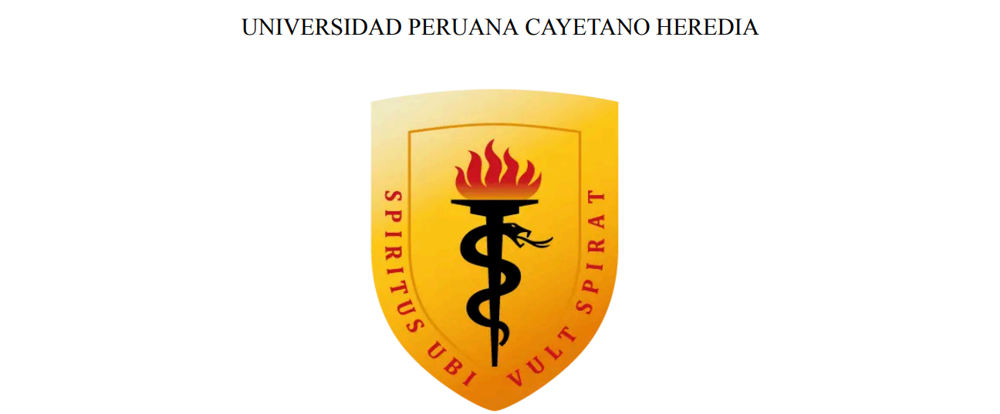

# Tema:
### Regresión en aprendizaje automático para predecir la concentración de ozono en el Condado de Baldwin, Alabama, EE.UU., basada en registros de 2022-2023

# **Curso:**
### Proyectos de Ingeniería 1

# **Integrantes:**
- Llanos Angeles Leily Marlith
- Luque Mamani Magno Ricardo
- Mendoz Villar Antony Iván
- Quispe Baldeon Melissa

# **Docentes:**
- Umbert Lewis de la Cruz Rodríguez
- Renzo Jose Chan Rios
- Marcos Miguel Retamozo Ramos
- Moisés Stevend Meza Rodríguez
- Harry Anderson Rivera Tito
- Pierre Giovanny Ramos Apestegui

#
#

## **1. Introducción**

El presente informe tiene como objetivo documentar el desarrollo e implementación de un modelo de TinyML en un Arduino Nano 33 BLE Sense. Este trabajo se centra en la interacción entre el dispositivo y LEDs de diferentes colores, que se activan en respuesta a dibujos específicos realizados por el usuario. La idea principal es utilizar el potencial del aprendizaje automático en dispositivos de bajo consumo para realizar inferencias en tiempo real, lo que abre un abanico de posibilidades en aplicaciones de Internet de las Cosas (IoT) y dispositivos inteligentes.

El uso de TinyML permite llevar modelos de aprendizaje automático a dispositivos con recursos limitados, facilitando su integración en proyectos de electrónica y robótica. Según Warden (2019), "TinyML es un enfoque que permite ejecutar modelos de aprendizaje automático en dispositivos embebidos, lo que permite realizar inferencias localmente sin necesidad de conexión a la nube". Este enfoque no solo mejora la latencia en la respuesta del sistema, sino que también optimiza el uso de recursos y la privacidad de los datos.

La implementación de este modelo en el Arduino Nano 33 BLE Sense se basa en tres condiciones específicas:

- Encender un LED rojo cuando se dibuje un círculo.
- Encender un LED azul cuando se dibuje el número 3.
- Encender un LED verde cuando se dibuje el número 1.

Estas condiciones permiten evaluar la capacidad de inferencia del modelo y su efectividad en la identificación de patrones en los datos de entrada. Tal como se menciona en el proyecto "Magic Wand" (2023), "la capacidad de los dispositivos para interpretar gestos o dibujos puede transformar la forma en que interactuamos con la tecnología".

A lo largo de este informe se detallarán los procedimientos de desarrollo, desde la recolección de datos hasta la implementación del modelo en el hardware, así como los resultados obtenidos y las conclusiones alcanzadas.

## **2. Recolección de datos**

## **3. Implementación del modelo**

## **4.  Resultados**

## **5. Conclusiones**

## **6. Referencias**

[1] P. Warden, TinyML: Machine Learning with TensorFlow Lite on Arduino and Ultra-Low-Power Microcontrollers, O'Reilly Media, 2019.

[2] "Magic Wand Project," YouTube, 2023. [Enlace: https://www.youtube.com/shorts/X7xZlTxPKVk].
